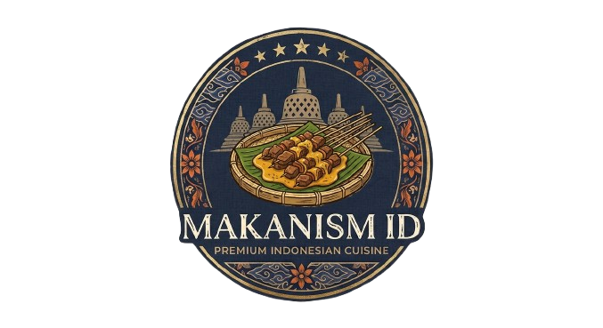
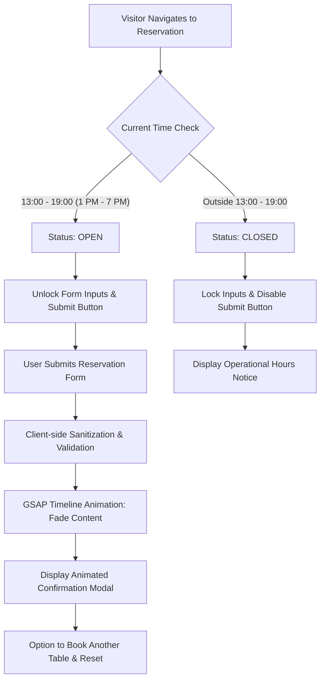

<div align="center">

  

  # ⚜️ MAKANISM ID ⚜️
  ### *The Ultimate Dining Experience — Where Gastronomy Meets Modern Luxury*

  <p align="center">
    A state-of-the-art culinary web experience featuring WebGL particle physics, GSAP kinetic animations, editorial typography, and a real-time reservation engine.
  </p>

  <p align="center">
    <a href="#-key-features"></a>
    <a href="#-technology-stack"></a>
    <a href="#-reservation-engine"></a>
    <a href="#-responsive-design"></a>
    <a href="LICENSE"></a>
  </p>

  ---

  <p align="center">
    <a href="#-about-the-project">About</a> •
    <a href="#-design-philosophy">Design Philosophy</a> •
    <a href="#-key-features">Key Features</a> •
    <a href="#-technology-stack">Tech Stack</a> •
    <a href="#-file-structure">File Structure</a> •
    <a href="#-reservation-system">Reservation Engine</a> •
    <a href="#-getting-started">Getting Started</a> •
    <a href="#-license">License</a>
  </p>

</div>

<br />

---

## 📖 About The Project

**Makanism ID** is a luxury Indonesian culinary showcase and fine-dining digital platform. Founded on the vision of elevating Nusantara heritage to the world stage, the website delivers a sensory-rich digital manifestation of the restaurant: combining dark-mode glassmorphic surfaces, pure Versailles gold highlights, interactive 3D particle dynamics, and seamless storytelling.

Every component is meticulously crafted without heavy CSS frameworks, maximizing performance, aesthetic finesse, and responsive fluidity across all device viewports.

---

## 🎨 Design Philosophy & Aesthetic Tokens

The design follows the principles of **Haute Gastronomie & Modern Noir**:

```
Primary Background     :  #050505 (Deep Obsidian Void)
Primary Gold Accent    :  #D4AF37 (Imperial Versailles Gold)
Secondary Champagne    :  #F3E5AB (Soft Vintage Cream)
Dark Surface (Glass)   :  rgba(255, 255, 255, 0.03) with 1px border #D4AF37
Typography (Headings)  :  'Playfair Display' (Classic Editorial Serif)
Typography (Body)      :  'Outfit' (Clean Geometric Sans-Serif)
```

- **Interactive 3D Stardust**: A live Three.js particle canvas reacting to cursor physics and parallax scrolling.
- **Magnetic Dual Cursor**: Custom precision pointer with dynamic inertia follower that reacts and expands upon interactive elements.
- **Glassmorphism & Depth**: Multi-layered backdrop blurs and subtle radial gold glows for a tactile, three-dimensional presence.

---

## ✨ Key Features

### 🌟 1. Cinematic Preloader Experience
- **Fluid Progress Tracking**: Smooth 1% to 100% digital counter synced with an animated golden progress bar.
- **Smart Transition Memory**: Preloader displays on full page refreshes while intelligently bypassing on internal article-to-home transitions using `sessionStorage`.

### 🌌 2. Three.js Particle Universe
- 800+ hardware-accelerated ambient stardust particles dynamically drifting in 3D WebGL space.
- Interactive mouse parallax that shifts particle depth relative to the viewer's focal point.

### 🎭 3. Full-Screen Interactive Luxury Menu
- Overlay menu triggered with custom hamburger transition.
- Dynamic background backdrop that seamlessly changes preview imagery upon hovering menu items.

### 🍽️ 4. Chef's Signature Specials & Rich Modal
- Interactive culinary cards showcasing dish metadata (cooking time, calories, ratings, price).
- **In-Depth Modal Dialog**: Detailed ingredient pills, Chef's tasting note, sommelier wine pairing suggestion, and allergen warnings.

### 🍱 5. Dynamic Filtering Menu
- Instant, zero-reload menu categorization (All, Main Courses, Artisanal Desserts, Handcrafted Beverages).
- Powered by GSAP scaling and opacity transitions with automatic ScrollTrigger recalibration.

### 📜 6. Heritage Story & Journal
- Parallax storytelling section with historical milestone statistics and image reveal animations.
- Dedicated multi-page editorial articles (`article.html`, `article-sustainable.html`, `article-cocktail.html`) with branded screen wipes.

### 🛡️ 7. Real-Time Operational Reservation Engine
- **Live Business Hours Gating**: Real-time evaluation of operating hours (**Open strictly 1:00 PM – 7:00 PM**). Outside these hours, booking controls and submission are cleanly disabled with an informative indicator badge.
- **Dark Mode Native Date/Time Controls**: Form calendar and clock icons inverted for high-contrast legibility against dark inputs.
- **Frontend XSS Sanitization**: User inputs are stripped and validated against strict regex patterns.
- **GSAP Animated Confirmation Stage**: Interactive success modal with a complete reset workflow to book additional reservations effortlessly.

---

## 🛠️ Technology Stack

| Category | Technology | Purpose |
| :--- | :--- | :--- |
| **Core Architecture** | `HTML5 (Semantic)` | Accessible, search-optimized document structure |
| **Styling & Effects** | `Vanilla CSS3` | Custom properties, Glassmorphism, CSS Grid, Flexbox, Mobile Queries |
| **Interactivity & Logic** | `Vanilla JavaScript (ES6+)` | Application state, modal control, real-time hours engine |
| **Kinetic Motion** | `GSAP 3.12.5 + ScrollTrigger` | Cinematic entrance, smooth reveals, timeline coordination |
| **3D Rendering** | `Three.js r128` | WebGL hardware-accelerated particle system |
| **Iconography** | `FontAwesome 6.6.0` | Vector icons for UI controls and meta statistics |
| **Typography** | `Google Fonts` | *Playfair Display* & *Outfit* font pairings |

---

## 📁 File Structure

```text
Makanism-id-main/
├── index.html                   # Primary landing page and core layout
├── style.css                    # Complete design system, animations, responsive rules
├── script.js                    # GSAP timelines, Three.js canvas, reservation logic
├── article.html                 # Journal: The Art of Plating
├── article-sustainable.html     # Journal: Sourcing Sustainable
├── article-cocktail.html        # Journal: Cocktail Culture
├── LICENSE                      # MIT Open Source License
├── README.md                    # Project documentation
└── image/                       # High-resolution optimized visual assets
    ├── makanismid.png           # Makanism gold crest logo
    ├── 1.png, 2.png, 3.png      # Philosophy icons (Precision, Passion, Innovation)
    ├── 6.jpg, 7.jpg, ...        # Interior ambiance & journal imagery
    ├── steak.jpg, salmon.jpg    # Signature dishes
    └── kue.jpg, nasi.jpg, ...   # Menu items & desserts
```

---

## ⚙️ Reservation Engine Architecture



---

## 📱 Responsive Design Matrix

Makanism ID is engineered for fluid scaling across all device categories:

| Breakpoint | Target Devices | Optimization Focus |
| :--- | :--- | :--- |
| **`> 1200px`** | Desktops & Ultra-wides | Full 3D particle canvas, dual cursor follower, expansive grid |
| **`992px - 1199px`** | Small Laptops & Tablets (Landscape) | Adjusted layout padding, proportional typography |
| **`768px - 991px`** | Tablets (Portrait) | Simplified full-screen navigation, stacked story layouts |
| **`480px - 767px`** | Large Smartphones (e.g. 489x668) | Stacked heritage section, columned footer, responsive badges |
| **`< 480px`** | Compact Smartphones | Touch-first CTA buttons, single-column specials & menus |

---

## 🚀 Getting Started

No compilers, bundlers, or heavy node environments required. Makanism ID runs natively in modern web browsers.

### Option 1: Live Server (VS Code Extension)
1. Clone or download this repository:
   ```bash
   git clone https://github.com/your-username/makanism-id.git
   ```
2. Open the folder in **Visual Studio Code**.
3. Right-click [`index.html`](index.html) and select **"Open with Live Server"**.

### Option 2: Python Local HTTP Server
Run directly via terminal:
```bash
# Python 3.x
python -m http.server 8080
```
Then visit [`http://localhost:8080`](http://localhost:8080) in your browser.

### Option 3: Direct Browser Launch
Simply double-click [`index.html`](index.html) to open it directly in Google Chrome, Microsoft Edge, Safari, or Mozilla Firefox.

---

## 🔒 Security & Client Integrity
- **Sanitized Outputs**: All submitted input values pass through an in-memory DOM parser to neutralize potential cross-site scripting (`<script>`, inline attributes).
- **Input Constraints**: Rigorous regex validation on guest telephone numbers and guest bounds (1 to 20 guests per table).
- **Double-Submission Prevention**: The submission trigger automatically locks with an asynchronous spinner state to prevent duplicate reservations.

---

## 📜 License

This project is distributed under the **MIT License**. See the [`LICENSE`](LICENSE) file for complete details.

<div align="center">
  <br />
  <sub>Crafted with passion for culinary excellence and premium web artistry.</sub>
  <br />
  <b>© 2025 - 2026 Makanism ID. All Rights Reserved.</b>
</div>
